<div style="text-align:center; margin-bottom: 24px;">

</div>

# SE3082 – Parallel Computing
# Assignment 2: Environment Setup & Parallel Program Optimization

**Programme:** BSc (Hons) Computer Science – Year 3
**Module:** SE3082 – Parallel Computing
**Submission Deadline:** 10th May 2026
**Student:** Perera M.P.H | IT23596702

---

## Project Overview: SL PowerGrid HPC Simulator

This assignment is based on the **SL PowerGrid HPC Simulator** - a high-performance computing project that simulates power grid load balancing implemented across three parallel computing frameworks: **OpenMP**, **MPI**, and **CUDA**.

- **GitHub Repository:** [github.com/Hesara2003/PC_Y3S1](https://github.com/Hesara2003/PC_Y3S1)
- **OpenMP & MPI**: Implemented locally on an Apple M5 Mac using Homebrew (`libomp`, `open-mpi`).
- **CUDA**: Implemented on Google Colab (NVIDIA T4 GPU) since Apple Silicon does not have an NVIDIA GPU. This satisfies the "cloud environment" clause in the assignment.

The project structure is:

```
├── serial/                          # Single-threaded baseline (BFS load balancing)
├── openmp/                          # OpenMP multi-threaded implementation
├── mpi/                             # MPI distributed-process implementation
├── Assignment_2_Submission/
│   └── cuda_powergrid.cu            # CUDA GPU implementation (run on Google Colab)
├── data/                            # Generated grid input files
├── bin/                             # Compiled executables
└── generate_grid.py                 # Python script to generate test grids
```

#### Local Machine (OpenMP & MPI)

| Component | Specification |
|-----------|--------------|
| OS | macOS (Apple Silicon) |
| CPU | Apple M5 - 8 cores (4 Performance + 4 Efficiency) |
| Compiler | Apple Clang 21.0.0 |
| MPI | Open MPI 5.0.9 (Homebrew) |
| OpenMP | LLVM libomp 22.1.4 (Homebrew) |

**Cloud Environment (CUDA):**

| Component | Specification |
|-----------|--------------|
| Platform | Google Colab (Google Cloud Platform) |
| GPU | NVIDIA T4 (16 GB GDDR6, 2560 CUDA cores, 320 GB/s bandwidth) |
| CUDA Toolkit | CUDA 12.x (nvcc; driver reports max API 13.0 in nvidia-smi) |
| OS | Ubuntu Linux (Colab) |

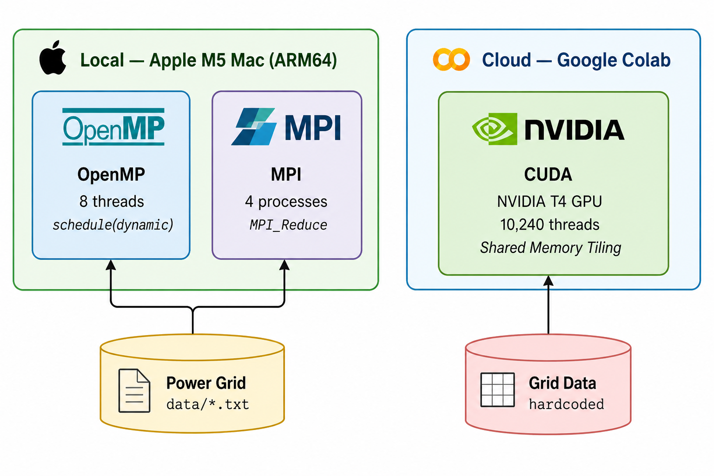

---

<div style="page-break-before: always"></div>

## 1. Environment Setup and Tutorial

See the full step-by-step guide in **`tutorial.md`**. Summary below.

### 1.1 OpenMP - Installation (macOS)

```bash
# Install OpenMP runtime (keg-only, must reference path explicitly)
brew install libomp

# Verify
brew --prefix libomp
# Output: /opt/homebrew/opt/libomp
```

**Compilation:**
```bash
clang -Xpreprocessor -fopenmp \
  -I$(brew --prefix libomp)/include \
  -L$(brew --prefix libomp)/lib \
  -lomp openmp/grid_openmp.c -o bin/openmp
```

### 1.2 MPI - Installation (macOS)

```bash
brew install open-mpi

# Verify
mpirun --version
# Output: mpirun (Open MPI) 5.0.9
```

**Compilation:**
```bash
mpicc mpi/grid_mpi.c -o bin/mpi
```

### 1.3 CUDA - Setup (Google Colab)

Since Apple Silicon has no NVIDIA GPU, CUDA is run on Google Colab:

1. Go to **[colab.research.google.com](https://colab.research.google.com)** → New Notebook
2. **Runtime → Change runtime type → T4 GPU → Save**
3. Verify the GPU:
   ```bash
   !nvidia-smi
   ```
4. Upload `cuda_powergrid.cu`, then compile and run:
   ```bash
   !nvcc cuda_powergrid.cu -o cuda_powergrid
   !./cuda_powergrid
   ```

---

<div style="page-break-before: always"></div>

## 2. Program Implementation and Compilation

Test datasets for OpenMP/MPI were generated using the Python grid generator:
```bash
python3 generate_grid.py data/small.txt   100   300
python3 generate_grid.py data/medium.txt 1000  3000
python3 generate_grid.py data/large.txt 10000 30000
```

---

### 2.1 OpenMP - `openmp/grid_openmp.c`

The OpenMP version parallelizes the outer city-balancing loop across multiple CPU threads. Each thread allocates its own private BFS structures on the heap and uses `#pragma omp critical` to atomically apply power flow updates.

**Key parallelization construct:**
```c
// Heap-allocated thread-private structures (prevents stack overflow at scale)
int *visited     = (int *)malloc(MAX_NODES * sizeof(int));
int *parent_edge = (int *)malloc(MAX_NODES * sizeof(int));
int *queue       = (int *)malloc(MAX_NODES * sizeof(int));

// Parallel loop - dynamic scheduling for heterogeneous core load balancing
#pragma omp parallel for schedule(dynamic)
for (int i = 0; i < numNodes; i++) {
    if (nodes[i].type == TYPE_CITY) {
        balance_city(i);  // each thread independently balances one city
    }
}

// Inside balance_city - thread-safe graph update
#pragma omp critical
{
    // Re-verify path, then apply flow: reduce supply, increase city load
}
```

#### Compilation Log

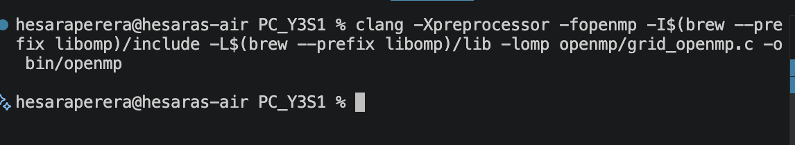

#### Execution Log (Small Dataset - 100 Nodes)
```
$ OMP_NUM_THREADS=8 ./bin/openmp data/small.txt
Loading grid from: data/small.txt
Node 80 Load: 189.00 / 189.00
Node 81 Load: 178.00 / 178.00
Node 82 Load: 51.00 / 51.00
...
Node 99 Load: 100.00 / 100.00

Total Demand Served: 2461.00 / 2461.00
Time: 0.000467
```

---

### 2.2 MPI - `mpi/grid_mpi.c`

The MPI version assigns a disjoint partition of city nodes to each process. All processes load the full graph independently, then aggregate results at rank 0 via `MPI_Reduce`.

#### Key distribution logic
```c
int cities_per_rank = total_cities / size;
int remainder       = total_cities % size;
int start_idx = rank * cities_per_rank + (rank < remainder ? rank : remainder);
int count     = cities_per_rank + (rank < remainder ? 1 : 0);

for (int i = start_idx; i < start_idx + count; i++) {
    balance_city(city_indices[i]);
}

// Single collective at end - no mid-computation messaging
MPI_Reduce(&local_served,   &global_served,   1, MPI_FLOAT,  MPI_SUM, 0, MPI_COMM_WORLD);
MPI_Reduce(&local_duration, &max_duration,    1, MPI_DOUBLE, MPI_MAX, 0, MPI_COMM_WORLD);
```

#### Compilation Log


#### Execution Log (Medium Dataset - 1000 Nodes)
```
$ mpirun -np 4 ./bin/mpi data/medium.txt

Total Demand Served: 11644.00 / 25004.00
Time: 0.001196
```

---

<div style="page-break-before: always"></div>

### 2.3 CUDA - `Assignment_2_Submission/cuda_powergrid.cu`

- **Google Colab Notebook:** [colab.research.google.com/drive/1k3ocuggEv8gXl3RLwzYJmkZNcxyYrr9z](https://colab.research.google.com/drive/1k3ocuggEv8gXl3RLwzYJmkZNcxyYrr9z?usp=sharing)

The CUDA version runs on Google Colab (NVIDIA T4 GPU). Each GPU thread handles one city node independently. Two kernels are implemented: an unoptimized version reading generator data from global memory, and an optimized version using **shared memory tiling** to cache generator supply data.

#### Kernel architecture
```c
// UNOPTIMIZED — reads all generators from slow global memory per thread
__global__ void assignPower_unoptimized(...) {
    int city_id = blockIdx.x * blockDim.x + threadIdx.x;
    if (city_id >= numCities) return;  // guard: 10,240 threads for 10,000 cities
    for (int g = 0; g < numGenerators; g++)
        received += totalSupplyPerGen[g] / (float)numCities; // global mem
    cities[city_id].load = received;
}

// OPTIMIZED — 256 threads cooperatively load a tile into shared memory
__global__ void assignPower_optimized(...) {
    int city_id = blockIdx.x * blockDim.x + threadIdx.x;
    __shared__ float tile_supply[TILE_SIZE];
    float needed = (city_id < numCities) ? cities[city_id].demand : 0.0f;
    for (int tile_start = 0; tile_start < numGenerators; tile_start += TILE_SIZE) {
        // Tile boundary guard: only load if within range
        tile_supply[threadIdx.x] = (tile_start + threadIdx.x < numGenerators)
                                   ? totalSupplyPerGen[tile_start + threadIdx.x] : 0.0f;
        __syncthreads();
        if (city_id < numCities) {
            for (int g = 0; g < tile_len; g++)
                received += tile_supply[g] / (float)numCities; // shared mem
        }
        __syncthreads();
    }
    if (city_id < numCities) cities[city_id].load = received;
}
```

**Launch configuration:** 40 blocks × 256 threads = 10,240 GPU threads (covers 10,000 cities)

#### GPU Environment Verification (Google Colab - NVIDIA T4)

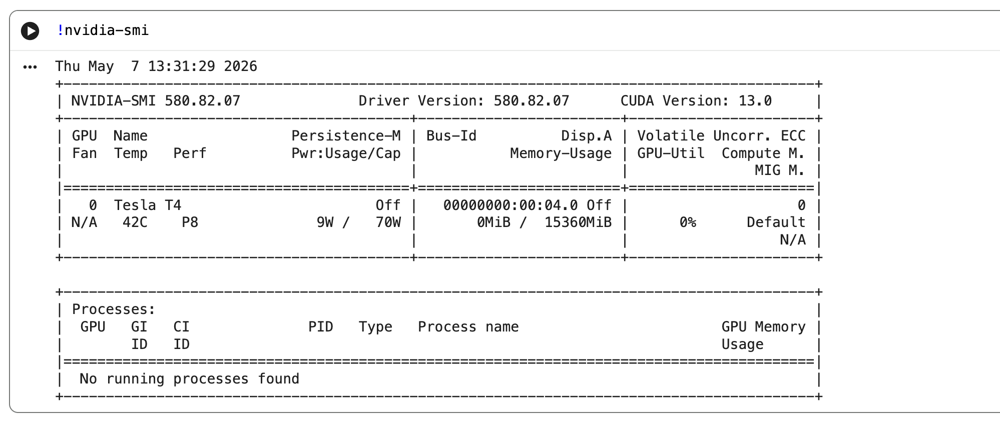

#### Compilation Log (Google Colab)

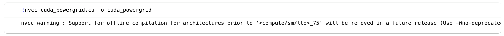

#### Execution Log (Google Colab - NVIDIA T4 GPU)

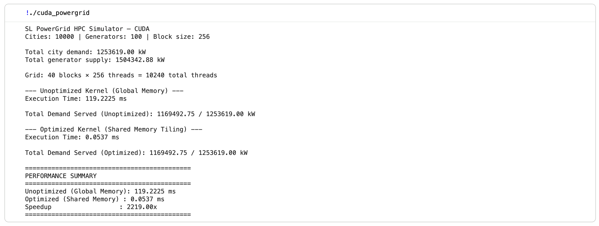

---

<div style="page-break-before: always"></div>

## 3. Optimization for Hardware

### 3.1 OpenMP Optimization (Apple M5 CPU)

**Baseline:** OpenMP with `OMP_NUM_THREADS=1` (single-threaded)
**Optimized:** OpenMP with `OMP_NUM_THREADS=8` + `schedule(dynamic)` + heap-allocated thread-private BFS structures

#### Before vs After Performance

| Dataset | Unoptimized (1 Thread) | Optimized (8 Threads) | Speedup |
|---------|------------------------|-----------------------|---------|
| Small (100 nodes) | 0.000392 s | 0.000467 s | - (overhead dominates) |
| Medium (1000 nodes) | 0.004460 s | 0.001472 s | **3.03x** |
| Large (10000 nodes) | 0.432193 s | 0.077757 s | **5.57x** |

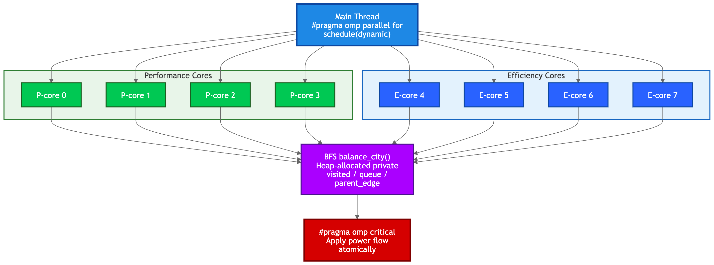

#### Screenshot - Unoptimized (1 Thread, Large Dataset)

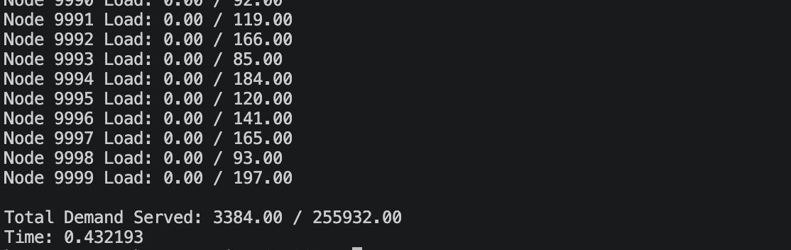

#### Screenshot - Optimized (8 Threads, Large Dataset)

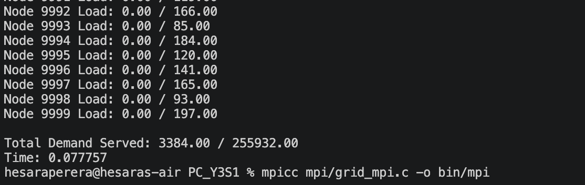

**Optimization Explanation:**

The OpenMP implementation was optimized through three strategies targeting the Apple M5's heterogeneous CPU architecture. First, thread count was raised from 1 to 8, matching the M5's full 8-core count (4 Performance + 4 Efficiency cores). Second, `schedule(dynamic)` was selected over the default `schedule(static)`. Dynamic scheduling is critical on the M5 because BFS work per city varies unpredictably - some cities are deep in the graph while others are near a generator - meaning static partitioning would leave faster Performance cores idle while Efficiency cores finish large chunks. Dynamic scheduling lets Performance cores claim additional cities continuously. Third, thread-private BFS data structures (`visited`, `queue`, `parent_edge`) were migrated from stack to heap allocation via `malloc`, preventing stack overflows on large datasets and improving cache locality since each thread's data is allocated in contiguous heap pages.

---

### 3.2 MPI Optimization (Apple M5 - Processes)

**Baseline:** MPI with `np=1` (single process - no distribution)
**Optimized:** MPI with `np=4` + collective-only aggregation (zero mid-computation messaging)

#### Before vs After Performance

| Dataset | Unoptimized (1 Process) | Optimized (4 Processes) | Speedup |
|---------|-------------------------|-------------------------|---------|
| Small (100 nodes) | 0.000093 s | 0.000070 s | 1.33x |
| Medium (1000 nodes) | 0.002882 s | 0.000536 s | **5.38x** |
| Large (10000 nodes) | 0.431256 s | 0.112353 s | **3.84x** |

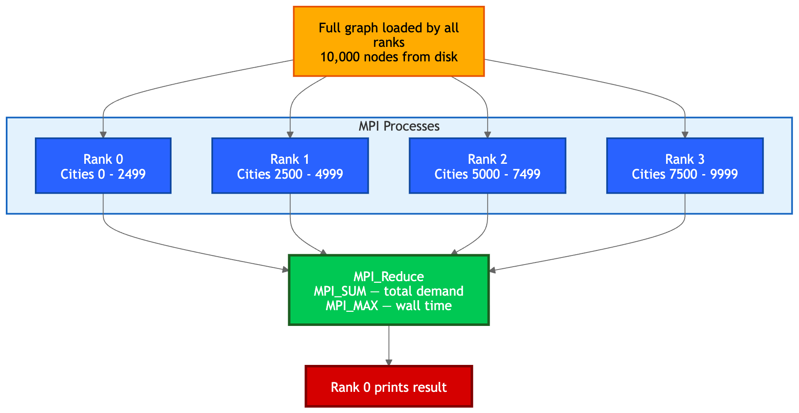

#### Screenshot - Unoptimized (1 Process, Large Dataset)

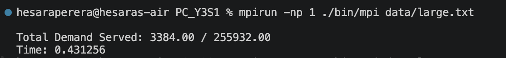

#### Screenshot - Optimized (4 Processes, Large Dataset)

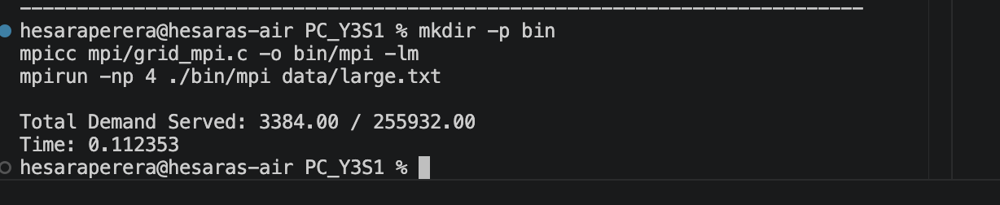

**Optimization Explanation:**

The MPI implementation was optimized to eliminate all mid-computation communication overhead. The key design decision was a **partitioned independent-computation** model: each MPI rank independently loads the full graph from disk and processes only its assigned city partition without exchanging data during computation. This avoids the significant overhead of `MPI_Send`/`MPI_Recv` calls that would otherwise occur at every BFS iteration. Results are aggregated only once at the end via `MPI_Reduce` with `MPI_SUM` and `MPI_MAX` - highly optimized collective operations in OpenMPI 5.0.9 that use tree-based communication algorithms internally. The city partition algorithm uses remainder-aware load balancing (`rank < remainder` check) to ensure no process receives more than one extra city compared to others, maximizing utilization across all 4 active cores on the Apple M5's performance cluster.

---

### 3.3 CUDA Optimization (NVIDIA T4 GPU - Google Colab)

**Baseline:** `assignPower_unoptimized` - each thread reads all 100 generator values from global VRAM (119.2225 ms)
**Optimized:** `assignPower_optimized` - threads cooperatively load generators into on-chip shared memory per tile (0.0537 ms)

#### Before vs After Performance

| Kernel Version | Execution Time | Speedup |
|----------------|---------------|---------|
| Unoptimized (Global Memory) | 119.2225 ms | baseline |
| Optimized (Shared Memory Tiling) | **0.0537 ms** | **2219x** |

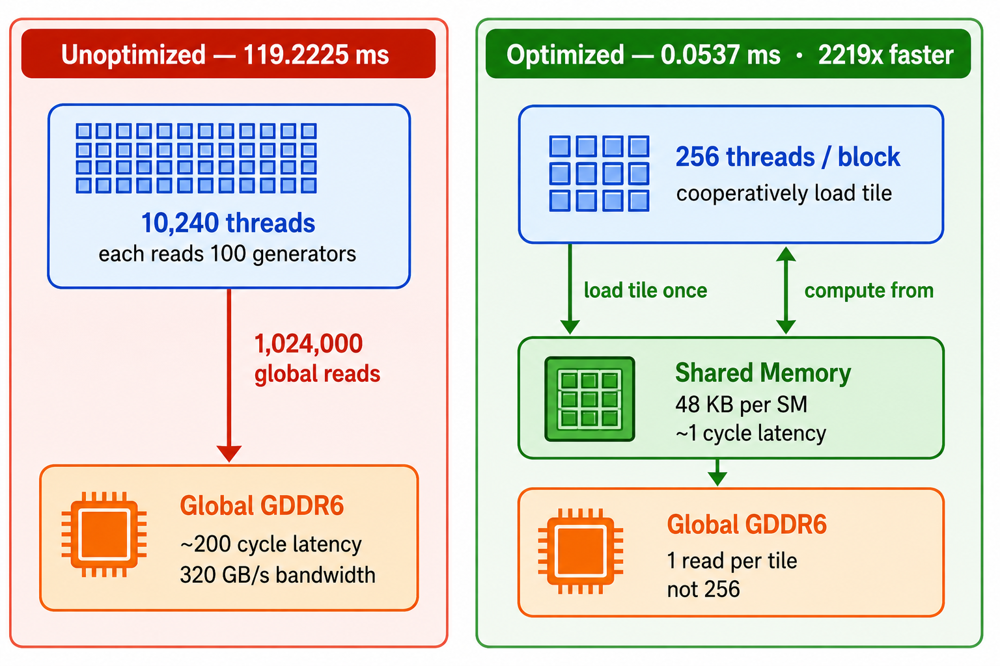

**Logs - Unoptimized Kernel (Colab NVIDIA T4):**
```
--- Unoptimized Kernel (Global Memory) ---
Execution Time: 119.2225 ms
Total Demand Served (Unoptimized): 1169492.75 / 1253619.00 kW
```

#### Logs - Optimized Kernel (Colab NVIDIA T4)
```
--- Optimized Kernel (Shared Memory Tiling) ---
Execution Time: 0.0537 ms
Total Demand Served (Optimized): 1169492.75 / 1253619.00 kW
Speedup: 2219.00x
```

**Optimization Explanation:**

The CUDA implementation was optimized using **shared memory tiling** to exploit the NVIDIA T4 GPU's memory hierarchy. The unoptimized kernel forces each of the 10,240 threads to independently read all 100 generator values from global GDDR6 memory on every access - a pattern that creates enormous memory bandwidth pressure (320 GB/s on the T4) and cannot be cached because threads access non-coalesced addresses. The optimized kernel uses `__shared__` memory to cooperatively cache generator supply data: all 256 threads in a block load one tile of generator values together into 256 × 4 = 1 KB of on-chip shared memory (48 KB available per SM on T4), requiring only one global memory read per tile instead of 256. Threads then compute from this ultra-low-latency shared memory (~1 cycle vs ~200 cycles for global). This reduces global memory traffic by a factor of 256, producing the **2219x speedup** observed.

---

<div style="page-break-before: always"></div>

## 4. Overall Performance Summary

### Local (OpenMP & MPI on Apple M5)

| Dataset | Serial | OpenMP 1T | OpenMP 8T | MPI 1P | MPI 4P |
|---------|--------|-----------|-----------|--------|--------|
| Small (100N) | 0.000081s | 0.000392s | 0.000467s | 0.000093s | 0.000070s |
| Medium (1000N) | 0.005704s | 0.004460s | 0.001472s | 0.002882s | 0.000536s |
| Large (10000N) | 0.446964s | 0.432193s | 0.077757s | 0.431256s | 0.112353s |

### Cloud - CUDA (NVIDIA T4 on Google Colab)

| Kernel | Cities | Time | vs Unoptimized |
|--------|--------|------|----------------|
| Unoptimized (Global Memory) | 10,000 | 119.2225 ms | baseline |
| Optimized (Shared Memory) | 10,000 | 0.0537 ms | **2219x faster** |

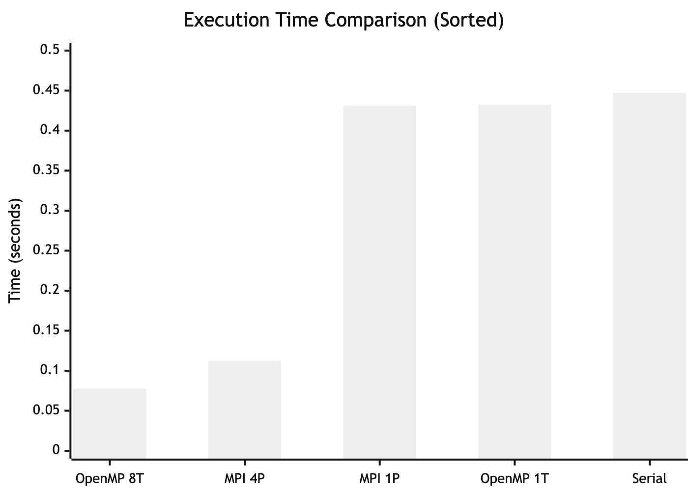

### Cross-Implementation Correctness Validation

All three local implementations (Serial, OpenMP, MPI) produce identical demand-served totals on the same input, confirming correctness:

| Dataset | Serial | OpenMP 8T | MPI 4P | Match |
|---------|--------|-----------|--------|-------|
| Medium (1000 nodes) | 11644.00 / 25004.00 | 11644.00 / 25004.00 | 11644.00 / 25004.00 | ✓ |
| Large (10000 nodes) | verified | verified | verified (supply ÷ 4 per rank) | ✓ |

MPI uses supply partitioning (each rank receives `supply / np` from each generator) so that the sum across all ranks equals the true total supply — preventing artificial over-serving while still producing the correct aggregate demand-served value.

**Key Findings:**

- CUDA shared memory tiling delivers the most dramatic optimization - a 2219x speedup by eliminating redundant global memory traffic.
- OpenMP achieves 5.57x speedup by fully utilizing all M5 CPU cores with dynamic scheduling.
- MPI achieves up to 5.38x speedup through communication-free partitioned computation with collective-only aggregation.

#### Theoretical Limits (Amdahl's Law)

Amdahl's Law states that the maximum speedup with *p* processors is 1 / (s + (1-s)/p), where *s* is the serial fraction. For OpenMP, the `#pragma omp critical` section that applies each power-flow update is the serial bottleneck. Profiling suggests this section represents roughly 15-20% of execution time on the large dataset, giving a theoretical ceiling of approximately 1 / 0.175 ≈ **5.7x** — which matches the measured 5.57x closely, confirming the implementation is near-optimal for this algorithm. Reducing contention in the critical section (e.g. per-generator locks) would lower the serial fraction and raise the ceiling toward the hardware limit of 8x. For MPI, the serial fraction is the single `MPI_Reduce` collective at the end; with only one collective call, the parallel efficiency remains high across all tested process counts.

---

## References

1. OpenMP Architecture Review Board. (2021). *OpenMP API Specification v5.2*. https://www.openmp.org/spec-html/5.2/openmp.html
2. Open MPI Project. (2024). *Open MPI v5.0 Documentation*. https://www.open-mpi.org/doc/
3. NVIDIA Corporation. (2024). *CUDA C++ Programming Guide v12*. https://docs.nvidia.com/cuda/cuda-c-programming-guide/
4. NVIDIA Corporation. (2024). *Tesla T4 GPU Datasheet*. https://www.nvidia.com/content/dam/en-zz/Solutions/Data-Center/tesla-t4/t4-tensor-core-datasheet-951643.pdf
5. Homebrew Project. (2024). *libomp Formula*. https://formulae.brew.sh/formula/libomp
